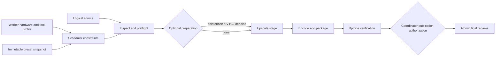

# Open-source video upscaling research

Research snapshot: 2026-09-06

Status: options analysis and implementation plan only. No backend has been
selected, bundled, installed, or run as part of this work.

## Executive recommendation

BackBurner should add upscaling as a pipeline operation, not as more fields on
`HandBrakeSettings`. The first implementation should be deliberately small:

1. Build a synthetic and rights-safe evaluation corpus before choosing a
   default model.
2. Prototype an **optional, externally installed Video2X 6.4 adapter**. It is a
   maintained Windows/Linux video pipeline with CLI control, FFmpeg-based video
   I/O, and Vulkan implementations of Real-ESRGAN and Real-CUGAN plus
   libplacebo/Anime4K shaders. It is the shortest route to useful cross-vendor
   testing.
3. Initially expose three named strategies:
   - **Real-ESRGAN / `realesrgan-x4plus`** for degraded live action and general
     material.
   - **Real-CUGAN** for lower-resolution animation and line art.
   - **Anime4K** only as a fast, low-resource 1080p-animation-to-4K option and a
     comparison baseline.
4. Keep ordinary high-quality scaling (Lanczos/libplacebo) as the control. An
   AI result should have to beat it visibly without introducing temporal or
   semantic defects.
5. Evaluate **RealBasicVSR through MMagic** as the first true temporal backend
   after the frame-based path is reliable. It is harder to package but uses
   information across frames and was designed for real-world degradation.
6. Keep **SeedVR2** and **FlashVSR** in an opt-in experimental lane for capable
   NVIDIA workers. Their generative strength can create attractive detail, but
   also creates archival-fidelity and reproducibility risks.
7. Do not make RVRT a supported household default: most of its code is
   noncommercially licensed, and its older CUDA/Python environment increases
   operational cost.

This recommendation is provisional. There is no honest way to declare one
open-source model "as good as Topaz" from project demos or paper benchmarks.
The deciding evidence must be side-by-side output on the household's actual
types of source material.

## What is being selected

An upscaling stack has three separable choices:

- **Model or shader**: the algorithm that restores or enlarges frames.
- **Inference runtime**: ncnn/Vulkan, PyTorch/CUDA, TensorRT, OpenVINO, or a
  shader engine.
- **Video pipeline**: decode, frame timing, color, audio/subtitle/attachment
  handling, encode, and container output.

Real-ESRGAN is a model family. Video2X is primarily a video pipeline that hosts
several models/runtimes. MMagic is a Python research/production toolbox. Treating
all three as interchangeable "upscalers" would make presets, capabilities, and
support responsibilities ambiguous.

BackBurner also needs to distinguish two algorithm classes:

- **Frame-based** algorithms process each frame independently. They are easier
  to tile, restart, and run on varied hardware, but fine texture can shimmer or
  change shape from frame to frame.
- **Temporal** algorithms inspect multiple frames and propagate or align
  features. They can produce more stable detail, but require more GPU memory,
  have boundary/scene-cut behavior, and make interruption and chunk resumption
  harder.

Frame interpolation is a separate operation. RIFE support in Video2X is useful
future evidence, but BackBurner must never silently change frame rate while a
user merely requests upscaling.

## Candidate summary

| Candidate | Type and best fit | Hardware / platform | Temporal behavior | License signal | Recommendation |
| --- | --- | --- | --- | --- | --- |
| FFmpeg/libplacebo scaling | Non-AI control; already-clean live action | CPU or common Vulkan/OpenGL/D3D11 GPUs; cross-platform | Stable because it does not synthesize per-frame detail | libplacebo LGPL-2.1-or-later; FFmpeg build-dependent | Required control and safe fallback |
| Anime4K v4 | Very fast shader restoration for mostly clean 1080p anime | Broad shader-capable GPUs; Video2X uses libplacebo | Per-frame; low compute, possible ringing/oversharpening | MIT | Tier 1 animation baseline, not a general model |
| Real-ESRGAN | General blind restoration; degraded live action; an anime-specific variant exists | ncnn/Vulkan across Intel, AMD, NVIDIA, Windows/Linux; PyTorch alternative | Per-frame; inspect for flicker and tile seams | Core BSD-3-Clause; official ncnn implementation MIT | Tier 1 general candidate |
| Real-CUGAN | Anime and illustration, with scale/denoise variants | ncnn/Vulkan across common GPU vendors; PyTorch alternative | Per-frame; inspect lines, credits, and texture stability | MIT | Tier 1 animation candidate |
| Video2X 6.4 | Video host for the preceding three, not itself one model | Prebuilt binary needs AVX2 and Vulkan; Windows/Linux; Linux AppImage/container options | Depends on selected processor | AGPL-3.0; dependencies have separate licenses | Best prototype adapter; keep optional/external pending packaging review |
| vs-mlrt + VapourSynth | Expert runtime layer with ONNX Runtime, TensorRT, OpenVINO, ncnn, MIGraphX, and CoreML paths | Widest backend coverage, but substantial VapourSynth/runtime setup | Model-dependent; scripting can control scenes and filters | GPL-3.0, plus dependencies/models | Tier 2 power-user adapter if hardware diversity demands it |
| RealBasicVSR / MMagic | Real-world degraded video using pre-cleaning plus temporal propagation | Practically an NVIDIA CUDA/PyTorch worker; Linux is the lowest-friction target | True temporal model; still inspect propagation artifacts | MMagic Apache-2.0; verify each checkpoint | Preferred Tier 2 temporal evaluation |
| BasicVSR++ | Temporal benchmark for bicubic/compressed-video restoration | CUDA/PyTorch research environment | True temporal propagation/alignment | MMagic Apache-2.0; verify checkpoint | Comparison candidate, not first default for unknown real-world degradation |
| RVRT | Temporal transformer for SR/deblur/denoise research | Documented against Ubuntu 18.04, CUDA 11.1, PyTorch 1.9.1+; tiling available | True clip/recurrent temporal model | Majority CC-BY-NC | Research reference only |
| SeedVR2 3B/7B | Generative restoration of difficult sources | Official reference needs very large CUDA GPUs; community quantized/offloaded runners may fit smaller RTX cards slowly | True temporal diffusion restoration | Apache-2.0 code; verify checkpoint and runner terms | Tier 3 opt-in lab backend with mandatory review |
| FlashVSR v1.1 | One-step streaming diffusion VSR | NVIDIA CUDA; about 24 GB minimum in NVIDIA's packaged integration; official tests center on A100-class GPUs | True streaming temporal model | Apache-2.0 | Tier 3 watch/prototype on a high-end worker only |

"License signal" is not legal advice and is not enough to authorize bundling.
The exact source revision, executable, model weights, FFmpeg build, and runtime
dependencies must all be inventoried before a BackBurner release distributes
them.

## Candidate details

### Video2X: best first integration host

[Video2X](https://github.com/k4yt3x/video2x) 6.x is a C/C++ rewrite with a CLI
and Windows GUI. It consumes and produces video through FFmpeg libraries and
supports Real-ESRGAN, Real-CUGAN, and RIFE through ncnn/Vulkan, plus Anime4K and
other mpv-compatible shaders through libplacebo. Current command-line options
include input/output, target dimensions or scale, model/shader selection, GPU
selection, and encoder options. Its 6.4 release also added input-stream metadata
copying and fixes for timestamp-less video.

Operational advantages:

- One executable can test several useful algorithms on Windows and Linux.
- Vulkan reaches NVIDIA, AMD, and Intel hardware without maintaining a CUDA
  environment on every worker.
- Frames can flow through the process without a directory full of PNGs or a
  giant lossless intermediate.
- GPU enumeration and selection are explicit CLI operations.
- The project publishes a Windows installer, a Linux AppImage, and container
  images.

Risks and validation needs:

- Prebuilt releases require an AVX2 CPU and a Vulkan-capable GPU. A successful
  Vulkan probe is more useful than trusting a GPU product-name allow-list.
- It is AGPL-3.0. BackBurner is MIT. The least surprising prototype is an
  optional adapter that invokes a separately installed executable, does not
  copy Video2X code, and does not bundle it. Distribution and network-source
  obligations still need review before shipping an installer containing it.
- "Copies stream metadata" does not establish correct preservation of every
  audio track, subtitle format, attachment, chapter, language/default/forced
  flag, HDR field, or Dolby Vision profile. Use `ffprobe` before and after and
  make preservation an acceptance gate.
- A streaming whole-file run avoids scratch growth, but a killed process is not
  safely resumable. Its retry unit should initially be the entire output.
- Video2X's encoder surface is not HandBrake's. A Video2X preset cannot merely
  reuse a `HandBrakeSettings` object.

Prototype verdict: **yes**, as an optional executable and evaluation vehicle.
Production verdict: contingent on media-preservation tests, cancellation tests,
and a written dependency-distribution decision.

### Real-ESRGAN: general frame-based baseline

[Real-ESRGAN](https://github.com/xinntao/Real-ESRGAN) is a blind
super-resolution/restoration family trained with synthetic degradations. The
official project includes general x4 models, a small general model with
adjustable denoise strength, anime models, and an `AnimeVideo-v3` model. It
offers both PyTorch and an official portable
[ncnn/Vulkan implementation](https://github.com/xinntao/Real-ESRGAN-ncnn-vulkan).

Why it belongs in the first experiment:

- It is a familiar, mature baseline for unknown real-world degradation.
- ncnn/Vulkan makes the same strategy available on heterogeneous household
  GPUs without Python.
- Tiling can bound memory use.

Why it is not automatically the winner:

- The ncnn implementation processes images/frames; it has no true temporal
  propagation. Hair, grass, film grain, compression noise, and tiny lettering
  can shimmer.
- Tiling can reveal seams or inconsistent blocks. Tile size and overlap belong
  in an advanced preset and the validation record.
- A GAN can create plausible texture that was not present in the source.
- The main project's latest published release is older than the surrounding
  runtime ecosystem. Pin and hash the executable and model instead of following
  an unversioned `latest` download.

Use `realesrgan-x4plus` as the initial general candidate. Test the small general
model and denoise strength only if the default looks waxy or amplifies noise.
The anime model should compete directly against Real-CUGAN, not silently replace
it.

### Real-CUGAN: animation specialist

[Real-CUGAN](https://github.com/bilibili/ailab/tree/main/Real-CUGAN) targets
anime/illustration restoration. Its published model set includes 2x, 3x, and 4x
choices, denoise strengths, and conservative variants; the
[ncnn/Vulkan port](https://github.com/nihui/realcugan-ncnn-vulkan) exposes those
as a portable executable.

It deserves a Tier 1 animation lane because line work and flat color are a
different problem from photographic texture. Test credits, signs, subtitles
baked into the image, thin diagonal lines, gradients, and old analog-source
animation. Its adjustable denoise is valuable, but too much denoise can erase
intentional grain and painted texture. Like Real-ESRGAN, it is frame-based and
needs a temporal-flicker review.

### Anime4K: speed baseline, not an archival default

[Anime4K](https://github.com/bloc97/Anime4K) is a modular real-time shader
system rather than a heavy neural restoration runtime. The project explicitly
says it is optimized for native 1080p anime and is not a replacement for SRGANs
on low-resolution or heavily degraded material. It also advises that permanent
4K re-encoding is irreversible and client-side real-time scaling is often the
better use.

That warning is important. BackBurner should offer Anime4K only when a permanent
derived 4K copy is actually desired, and preserve the source. It is useful as:

- a fast 1080p-to-4K animation option on modest GPUs;
- an operational smoke test for the whole upscale pipeline;
- a guard against spending hours on a model that does not beat a shader in a
  blind comparison.

### libplacebo/FFmpeg: the control that AI must beat

[libplacebo](https://github.com/haasn/libplacebo) supplies high-quality
gamma-correct scaling, anti-ringing, color management, HDR tone mapping, and a
custom shader system across Vulkan, OpenGL, and Direct3D 11. It is not an AI
restorer, and that is precisely why it is essential.

For a clean 1080p source, a careful non-generative scale may retain intent more
faithfully than a restoration model. The evaluation UI should always include a
plain high-quality scale or the original-resolution encode as a control. HDR
tone mapping must remain a separately selected color operation; upscaling must
not imply conversion to SDR.

### vs-mlrt: broad hardware coverage at the price of complexity

[vs-mlrt](https://github.com/AmusementClub/vs-mlrt) is a collection of
VapourSynth ML runtimes with a unified Python wrapper. It supports CPU,
OpenVINO/Intel GPU, ONNX Runtime CPU/CUDA, TensorRT and TensorRT-RTX on NVIDIA,
MIGraphX on AMD, ncnn/Vulkan, and CoreML on Apple hardware. Supported model
families include Real-ESRGAN, Real-CUGAN, waifu2x, denoisers, and interpolation
models.

This is the strongest option if future profiling shows that Video2X leaves too
much performance unused on mixed hardware. It also permits expert VapourSynth
filter graphs for inverse telecine, deinterlacing, scene handling, denoise, and
upscale. The cost is a much larger installation and compatibility matrix,
per-machine TensorRT engine compilation, script security concerns, and a
GPL-3.0 distribution review. Do not make arbitrary user scripts part of the
first API; use typed, generated pipelines if this backend is added.

### RealBasicVSR and BasicVSR++: sensible temporal research

[MMagic](https://github.com/open-mmlab/mmagic) provides CLI/Python inference for
BasicVSR, BasicVSR++, and RealBasicVSR, among other restoration models.
BasicVSR++ uses propagation and alignment to aggregate information from multiple
frames. [RealBasicVSR's paper](https://openaccess.thecvf.com/content/CVPR2022/papers/Chan_Investigating_Tradeoffs_in_Real-World_Video_Super-Resolution_CVPR_2022_paper.pdf)
adds pre-cleaning because long temporal propagation can amplify real-world noise
and artifacts as well as detail.

That makes RealBasicVSR the most relevant first temporal comparison for old or
compressed household video. It should be tested against Real-ESRGAN, not assumed
superior. Challenges include a pinned Python/PyTorch/CUDA environment, checkpoint
management, higher memory use, frame/clip ingestion, scene boundaries, and
progress reporting. A Linux NVIDIA worker is likely the easiest supported host;
Windows support should follow only if the exact locked environment passes the
same tests.

### RVRT: technically interesting, unsuitable default terms

[RVRT](https://github.com/JingyunLiang/RVRT) combines local parallel clip
processing with globally recurrent features for video SR, deblur, and denoise.
It documents spatial/temporal tiling for memory limits. Its published environment
is from the Ubuntu 18.04/CUDA 11.1/PyTorch 1.9.1 era, and the repository states
that the majority of the code is CC-BY-NC. That combination makes it useful as a
quality reference or private experiment, but a poor supported backend for a
public general-purpose application.

### SeedVR2: powerful generation, high fidelity risk

[SeedVR/SeedVR2](https://github.com/ByteDance-Seed/SeedVR) are diffusion-based
generic video-restoration models. The official code is Apache-2.0, but its
reference inference is designed around very large NVIDIA GPUs: the documentation
uses an H100 80 GB for 100 frames at 720p and four H100s for larger material.
[Community implementations](https://github.com/comfyorg/comfyui_seedvr2) add
chunking, tiling, quantization, CPU offload, and standalone/ComfyUI runners,
which may bring execution down into consumer RTX VRAM ranges at a substantial
speed and support cost.

The official project itself warns that strong generation can overproduce detail
or oversharpen lightly degraded input, particularly at small resolutions, and
can fail on heavy degradation or large motion. That is not a minor footnote for
a media archive. A SeedVR2 result should be treated as a creative restoration:

- opt in per job;
- keep the original;
- record seed, model/checkpoint hash, runner version, quantization, tile/chunk
  settings, and all post-processing;
- require human A/B approval before publishing a first result for a title;
- display "generative restoration" distinctly from ordinary scaling.

### FlashVSR: promising, not household-portable yet

[FlashVSR](https://github.com/OpenImagingLab/FlashVSR) is a one-step streaming
diffusion VSR model. The authors report about 17 frames/s for 768x1408 video on
one A100 and recommend 4x operation. NVIDIA's
[FlashDreams integration](https://github.com/NVIDIA/flashdreams/blob/main/docs/source/models/flashvsr.rst)
documents about 24 GB minimum VRAM and PyTorch 2.9+. The official project reports
testing mainly on A100/A800-class hardware and cautions that common RTX 40/50
compatibility was not yet established in its published instructions.

This is attractive for a future always-on high-end NVIDIA worker because it is
streaming and much faster than multi-step diffusion methods. Today it should be
an experimental capability that only a specifically validated worker advertises.
Do not infer support from `gpu:nvidia` alone.

## Quality: what "good" means here

Paper metrics and project demos answer whether a model performs well on a
particular benchmark and degradation recipe. They do not answer whether it
preserves a specific disc rip, broadcast encode, analog transfer, or existing
1080p master. BackBurner needs a local acceptance corpus.

### Corpus

Use short, rights-safe clips or locally generated test material. Keep production
media paths and titles out of the public repository. Include:

- clean 1080p live action destined for 4K;
- compressed 720p and 480p live action;
- clean digital anime and older film/analog-source animation;
- film grain, smoke, rain, water, foliage, hair, fabric, and skin;
- high motion, camera pans, zooms, hard cuts, dissolves, and fades;
- small faces, credits, signs, UI graphics, line art, and hard subtitles;
- interlaced and telecined sources, handled by an explicit pre-operation;
- SDR BT.709 and at least one HDR sample if HDR output is in scope;
- variable-frame-rate and odd-dimension torture samples;
- multiple audio/subtitle/chapter/attachment combinations.

For synthetic degradation tests, retain the high-resolution original as ground
truth, generate the low-resolution input deterministically, and compare the
upscale back to ground truth. Also include real degraded clips without ground
truth, because synthetic scores can reward the wrong behavior.

### Review dimensions

Record more than a single score:

- temporal flicker and texture crawling;
- hallucinated or semantically altered detail;
- edge halos, ringing, oversharpening, waxy skin, and erased grain;
- text, faces, line intersections, and repeating-pattern integrity;
- color primaries, transfer, matrix, range, bit depth, chroma format, mastering
  metadata, and HDR/Dolby Vision behavior;
- frame count, presentation timestamps, duration, cadence, and A/V sync;
- preservation and flags of audio, subtitles, chapters, and attachments;
- output bitrate/size and a transparent record of the final encoder;
- wall time, frames/s, peak VRAM/RAM, GPU/CPU utilization, power/thermal
  throttling, NAS traffic, and scratch high-water mark;
- output stability across scene/chunk boundaries and across repeated runs.

Useful objective measures include PSNR and SSIM against known ground truth,
LPIPS or another perceptual distance, VMAF with care, and no-reference metrics
as secondary signals. None should override blind visual review. Perceptual or
no-reference scores can reward confident invented texture.

### Experiment design

1. Freeze every input clip and hash it.
2. Generate the non-AI control and each candidate with a checked-in manifest of
   non-sensitive settings.
3. Normalize comparison outputs to the same dimensions, color representation,
   and sufficiently transparent encode so the upscaler—not a bitrate mismatch—is
   being judged.
4. Produce randomized, unlabeled A/B or A/B/X comparison clips and 100%-scale
   crops. Review moving video, not just still frames.
5. Run each strategy on more than one content class; never crown a universal
   winner from one clip.
6. Capture machine profile and resource metrics alongside subjective notes.
7. Establish content-specific presets only after the results repeat.

Suggested acceptance gate for Tier 1: no timing/stream regressions; no visible
tile/chunk boundary; no material temporal defect; wins or ties the non-AI
control in blinded review; can be stopped, cleaned, retried, and reproduced;
and completes within the household's agreed time/storage budget.

## BackBurner architecture impact

The current contract has one immutable `HandBrakeSettings` snapshot per job.
The coordinator derives two string capabilities (`handbrake` and the encoder),
and `WorkerAgent.ExecuteAsync` runs one HandBrake process into a fenced partial
destination. This is a sound vertical slice, but upscaling should not be folded
into it as optional HandBrake fields.

The target shape is an immutable operation graph:

The graph need not become a general workflow language in its first release.
Typed ordered operations are safer and sufficient:

- `InspectOperation`
- optional `VideoPreparationOperation`
- optional `UpscaleOperation`
- `EncodeOperation`
- `VerifyOperation`
- `PublishOperation`

### Contracts and presets

Introduce a versioned `MediaWorkflow` snapshot on jobs. Each operation should
be a discriminated, validated contract, not arbitrary command text. Existing
HandBrake jobs can migrate in memory as a one-operation encode workflow, keeping
the persisted-state rollback/migration implications explicit.

An upscale operation needs at least:

- strategy/backend ID and contract version;
- model ID, model/checkpoint digest, and runtime version constraint;
- integer scale or exact output dimensions, with an explicit fit/crop policy;
- content hint (`general`, `animation`, or future values) as operator intent,
  never guessed authority;
- denoise/restoration strength where the model supports it;
- tile, overlap, chunk, temporal-overlap, precision, quantization, and seed
  fields, divided into normal and advanced UI controls;
- color/HDR preservation policy;
- expected scratch-space formula or conservative estimate;
- required typed resources and capabilities.

Like today's presets, a named workflow preset is mutable but every queued job
must copy an immutable snapshot. Model aliases must also resolve to a digest at
queue time or claim time under a strict policy; `latest` is not reproducible.

### Worker backend boundary

Keep operating-system and tool behavior behind `BackBurner.Worker.Core`
interfaces. A backend registry can map a typed operation to a process runner
and tool probe. Each runner should provide:

- availability probe and exact version/model inventory;
- structured argument arrays, never a shell command assembled from user text;
- input/output contract and scratch estimate;
- progress/ETA parser with an explicit "indeterminate" state;
- pause/resume/stop capabilities (which vary by backend);
- retryable versus terminal error classification;
- cleanup of only lease-owned scratch/artifacts;
- a completion manifest for verification and history.

Initial adapters should be external-process adapters. Loading CUDA/PyTorch or
native inference libraries into the .NET worker would make crashes, dependency
conflicts, upgrades, and GPU cleanup affect the worker control plane.

### Capability and hardware model

The current exact string-set matching can support the first spike but not the
finished design. Initial tags might look like:

- `upscale:video2x:realesrgan`
- `upscale:video2x:realcugan`
- `upscale:video2x:anime4k`
- `runtime:vulkan`
- `gpu:nvidia` / `gpu:amd` / `gpu:intel`
- `model:realesrgan-x4plus:<short-digest>`

Numeric constraints should become typed scheduler resources rather than an
explosion of tags:

- dedicated and available VRAM;
- system RAM;
- scratch bytes free on the correct filesystem;
- GPU vendor/device and supported compute/Vulkan features;
- supported precisions and runtime versions;
- CPU instruction set (for example AVX2);
- hardware decode/encode support;
- thermal or power policy if profiling proves it necessary.

Workers should advertise **probed facts**, not configuration wishes. A model
capability appears only after the executable starts, the GPU initializes, the
specific weights are present and hash correctly, and a tiny self-test succeeds.
The dashboard can then show "installed but unavailable" separately from
"capable and schedulable."

The existing one-execution-slot rule should remain for the first upscaling
milestone. A GPU upscale still consumes decoder, CPU, memory, NAS I/O, and often
an encoder; it must not run beside a CPU encode merely because the GPU appears
idle. Multi-resource concurrent leases should wait for measurements and a
fenced multi-slot scheduler design.

### Artifacts, storage, and publication

There are three implementation shapes:

1. **One streaming tool produces the final encoded partial.** Lowest scratch
   use and best first fit for Video2X, but the whole file restarts after process
   loss and encoder choices belong to that tool.
2. **Upscaler produces a lossless/mezzanine intermediate, then HandBrake
   encodes it.** Reuses HandBrake presets and isolates stages, but a 4K
   intermediate can be enormous and doubles I/O.
3. **Frame/pipe streaming between separate processes.** Avoids a giant
   intermediate and preserves separate runners, but pipe backpressure,
   subprocess-tree cancellation, progress, and crash recovery are complex.

Start with shape 1 for the Video2X spike. Measure the feature/metadata gaps.
Adopt shape 2 only for short tests or when resumable stage boundaries justify
the space. Consider shape 3 after the contract is stable.

Every shape must preserve existing publication invariants:

- resolve logical paths through configured roots and reject traversal;
- write only to a lease-unique `.backburner-partial` or worker-local scratch
  namespace;
- never expose intermediate output at the final media filename;
- never overwrite an existing destination;
- verify the completed partial before publication;
- present lease UUID and fencing generation for every mutation;
- obtain coordinator publication authorization immediately before the
  same-filesystem atomic rename;
- let cancellation and publication remain mutually fenced.

Model caches and scratch are machine-local configuration, not logical media
roots. Do not download weights during a claimed production job. Pre-stage,
hash, self-test, and advertise them before scheduling.

### Interruptions, chunks, and retries

BackBurner's existing distinction remains correct: encoder/backend failures
consume the bounded attempt budget; human return, operator stop, service
shutdown, coordinator lease interruption, and game-development preemption do
not.

For a whole-file streaming backend, any interruption deletes the lease-owned
partial and requeues from zero. For chunk-capable temporal backends, safe resume
requires a durable manifest containing source hash, operation snapshot hash,
model digest, chunk boundaries, temporal overlap, seed, completed artifact
hashes, and fencing generation. A new lease must not trust another lease's
unfinished chunk. It may adopt verified content-addressed chunks only through a
coordinator-authorized protocol designed for that purpose.

Do not implement resumable chunks in Tier 1. First establish deterministic
whole-file semantics. Temporal overlap and scene boundaries can otherwise make
two individually valid chunks produce a visible seam.

Personal-desktop behavior should remain finish-current by default. The Windows
notification should say "upscaling" or "encoding" accurately, show backend ETA
when available, and retain Pause/Stop & Requeue. If a backend cannot pause, the
UI must not promise pause; Stop & Requeue is still safe. Shared game workers
must run the entire process tree inside the existing `cody-workerctl` fenced
scope and yield to development work exactly as HandBrake does.

### Verification and provenance

Upscale completion is not merely exit code zero. Before publication, compare
source, requested workflow, and output with `ffprobe` or equivalent:

- output exists, is nonempty, decodes, and has the requested dimensions;
- duration, frame count/timing, and frame rate are within explicit tolerances;
- required audio/subtitle/chapter/attachment streams and flags survived;
- color/HDR metadata matches the chosen policy;
- no temporary image sequence or model log leaked beside the media;
- output does not already exist at the final path.

Persist a provenance manifest in coordinator history (not necessarily beside
the media): backend and version, model digest, full immutable settings, worker
hardware profile, source fingerprint, output fingerprint, timestamps, resource
high-water marks, and verification result. Avoid storing real public media
filenames in checked-in fixtures or documentation.

## UI and machine API shape

The New Job tab should present a workflow rather than a single encoder form:

1. Source/batch selection.
2. Optional preparation.
3. Optional upscale/restoration, with a short description of fidelity risk.
4. Final encode/package settings.
5. Destination and publish policy.
6. Eligibility estimate: capable workers, missing models, scratch estimate, and
   rough duration from historical throughput.

Normal users should choose a named strategy and a few safe controls. Advanced
tile/chunk/precision/runtime controls can be collapsed. A generative strategy
must be visually distinct and require explicit acknowledgement; it is not just
"higher quality."

Dashboard/history additions:

- stage name and stage-level progress;
- worker/model/backend actually selected;
- why queued work currently has no eligible worker;
- CPU/GPU/VRAM/scratch high-water marks and throughput;
- interruption and retry history per stage;
- model-version drift or a now-missing dependency;
- link to the verification/provenance record.

The versioned integration API should add a new workflow schema version rather
than overload v1 HandBrake settings. Creation returns the same job handle and
control-token behavior. Status should expose current operation, overall and
operation progress, eligibility explanation, and verification outcome. Removal
continues to mean cancel/retain-history, never destructive deletion of media or
the audit record.

## Packaging and security

- Keep all upscalers optional. A HandBrake-only worker remains valid.
- Pin executable/container/package versions and SHA-256 hashes. Do the same for
  every checkpoint.
- Maintain a checked-in third-party inventory containing source URL, revision,
  code license, weights license, runtime licenses, download size, and supported
  platforms. Generate release notices from it if BackBurner later bundles files.
- Never accept arbitrary executable paths, model URLs, VapourSynth scripts, or
  FFmpeg option strings from a LAN API job. Administrators install allow-listed
  backend definitions; jobs select typed IDs and validated values.
- Download dependencies out of band. A worker should not make an unexpected
  Internet request while holding a job or NAS write access.
- Run tools with least privilege. Model parsers and media decoders consume
  untrusted binary formats and should not run as the Plex service identity.
- Keep NAS credentials, API keys, local mount mappings, model-cache paths, and
  hardware-specific tuning outside the public repository.
- Treat model files as executable supply-chain inputs: hash, quarantine until
  validated, and prefer formats/runtimes that avoid arbitrary Python pickle
  loading.

## Phased delivery plan

### Phase 0: evidence and contracts (roughly 2-4 focused engineering days)

- Build the rights-safe corpus and comparison manifest format.
- Inventory worker CPU, GPU, driver, Vulkan/CUDA support, VRAM/RAM, scratch, and
  sustained thermal behavior.
- Define typed workflow/upscale contracts, provenance, and validation policy.
- Decide whether Tier 1 may use Video2X's encoder or must feed a later HandBrake
  stage.
- Perform a written Video2X/FFmpeg/model distribution-license review.

Exit: reproducible manual commands and non-AI controls exist; no coordinator
change is required yet.

### Phase 1: portable frame-based prototype (roughly 5-8 engineering days)

- Add external Video2X probing and an allow-listed process adapter.
- Support one whole-file output shape and worker-local model inventory.
- Add Real-ESRGAN general, Real-CUGAN animation, and Anime4K strategies.
- Add typed hardware/model eligibility, stage progress, interruption, cleanup,
  verification, provenance, and synthetic state-machine tests.
- Run the corpus on representative Intel/AMD/NVIDIA workers that actually
  exist; record throughput and peak resources.

Exit: one or more strategies pass timing/stream/fencing/cancellation gates and
win a blind comparison for a documented content class. No strategy becomes the
universal default.

### Phase 2: production workflow and temporal comparison (roughly 7-12 days)

- Generalize jobs from HandBrake settings to versioned typed workflows with a
  migration/rollback plan.
- Add workflow presets, UI/API representation, eligibility explanations, and
  stage history.
- Package a pinned Linux CUDA environment for MMagic/RealBasicVSR on one
  deliberately selected worker.
- Compare RealBasicVSR and BasicVSR++ with Tier 1 on degraded live action,
  motion, scene cuts, and long sequences.
- Decide whether the quality gain justifies maintaining the Python/CUDA stack.

Exit: temporal support is either promoted for a narrow content class or rejected
with retained evidence.

### Phase 3: high-end generative lab (time-box separately)

- Reserve a >=24 GB NVIDIA worker or explicitly document an offload experiment.
- Evaluate SeedVR2 and FlashVSR with human approval gates and reproducibility
  records.
- Stress long-video chunk boundaries, VRAM recovery after cancellation, driver
  faults, and repeated invocation.
- Compare against both Tier 1 and any available commercial reference using the
  same normalized outputs.

Exit: opt-in generative preset only. Promotion requires stable consumer/server
GPU support, bounded resource use, acceptable hallucination rate, and clear
license/provenance.

The estimates are implementation effort after dependencies and test hardware
are available; they are not elapsed-time promises. Model evaluation time scales
with the corpus and hardware.

## Recommended next experiment

Without changing BackBurner, use one short clip from each major content class
and manually produce these five outputs at the same final resolution and a
transparent comparison encode:

1. libplacebo/Lanczos control;
2. Anime4K v4 for animation only;
3. Real-ESRGAN general;
4. Real-ESRGAN AnimeVideo-v3 for animation;
5. Real-CUGAN for animation.

Run them through Video2X 6.4 on one Vulkan-capable worker, recording exact
commands, tool/model hashes, wall time, GPU/CPU/RAM/VRAM, and `ffprobe` before
and after. If none of the frame-based candidates is clearly acceptable on
degraded live action, move that class directly to a RealBasicVSR experiment
instead of tuning dozens of Real-ESRGAN variants.

Do not start with SeedVR2. A visually impressive generative result would not
answer the more important first question: whether a portable, deterministic,
and supportable option is already good enough.

## Sources

Primary project documentation and papers, accessed 2026-09-06:

- [Video2X repository and hardware/license overview](https://github.com/k4yt3x/video2x)
- [Video2X command-line documentation](https://docs.video2x.org/running/command-line.html)
- [Video2X releases](https://github.com/k4yt3x/video2x/releases)
- [Real-ESRGAN repository](https://github.com/xinntao/Real-ESRGAN)
- [Real-ESRGAN ncnn/Vulkan implementation](https://github.com/xinntao/Real-ESRGAN-ncnn-vulkan)
- [Real-CUGAN repository](https://github.com/bilibili/ailab/tree/main/Real-CUGAN)
- [Real-CUGAN ncnn/Vulkan implementation](https://github.com/nihui/realcugan-ncnn-vulkan)
- [Anime4K repository](https://github.com/bloc97/Anime4K)
- [libplacebo repository](https://github.com/haasn/libplacebo)
- [vs-mlrt repository](https://github.com/AmusementClub/vs-mlrt)
- [MMagic repository and model zoo](https://github.com/open-mmlab/mmagic)
- [MMagic video super-resolution inference guide](https://github.com/open-mmlab/mmagic/blob/main/docs/en/user_guides/inference.md)
- [RealBasicVSR paper](https://openaccess.thecvf.com/content/CVPR2022/papers/Chan_Investigating_Tradeoffs_in_Real-World_Video_Super-Resolution_CVPR_2022_paper.pdf)
- [BasicVSR++ paper](https://openaccess.thecvf.com/content/CVPR2022/papers/Chan_BasicVSR_Improving_Video_Super-Resolution_With_Enhanced_Propagation_and_Alignment_CVPR_2022_paper.pdf)
- [RVRT repository](https://github.com/JingyunLiang/RVRT)
- [SeedVR and SeedVR2 repository](https://github.com/ByteDance-Seed/SeedVR)
- [ComfyUI SeedVR2 implementation](https://github.com/comfyorg/comfyui_seedvr2)
- [SeedVR paper](https://openaccess.thecvf.com/content/CVPR2025/papers/Wang_SeedVR_Seeding_Infinity_in_Diffusion_Transformer_Towards_Generic_Video_Restoration_CVPR_2025_paper.pdf)
- [SeedVR2 paper](https://arxiv.org/abs/2506.05301)
- [FlashVSR repository](https://github.com/OpenImagingLab/FlashVSR)
- [NVIDIA FlashDreams FlashVSR requirements](https://github.com/NVIDIA/flashdreams/blob/main/docs/source/models/flashvsr.rst)
